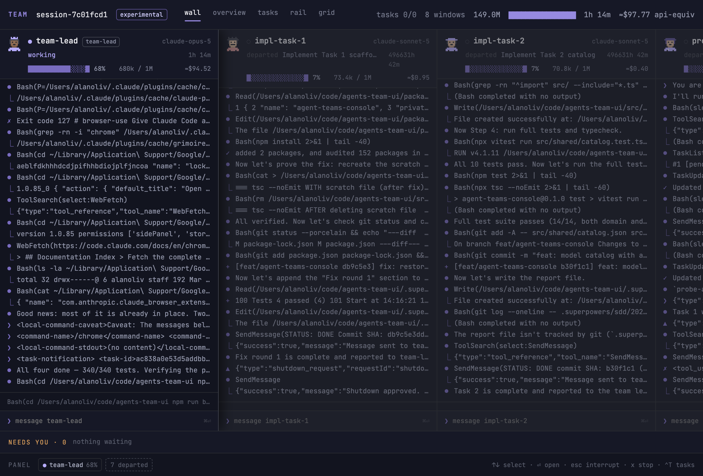

# Agent Teams Console

A Claude Code plugin. When a session spawns a **team** of teammates, this puts all
of them side by side in a browser window: every teammate's live transcript, the
shared task list, the mailboxes they talk through, who is burning context, and
what is waiting on you.



You never start it. The plugin's `PreToolUse`/`PostToolUse` hooks on the `Agent` tool
watch for the moment a real team comes into existence and start the server
themselves, then print the URL into the session once — before the teammate spawns
when possible, falling back to just after it:

```
Agent teams console → http://127.0.0.1:4823/?team=session-98b0b4a7
```

## Five views

| | |
|---|---|
| **wall** | one transcript column per teammate, lead pinned on the left |
| **overview** | one tile per agent with a context-occupancy bar |
| **tasks** | the shared task list plus the mailbox traffic behind it |
| **rail** | a keyboard-navigable agent list with one big transcript |
| **grid** | six panes at once for a wide monitor |

Across the bottom, **NEEDS YOU** collects everything blocked on a human. From any
view you can message a teammate, ask it to wrap up or stop, or answer a permission
prompt without switching back to the terminal.

## Requirements

- **Claude Code with agent teams enabled.** Teams are an experimental feature:
  `CLAUDE_CODE_EXPERIMENTAL_AGENT_TEAMS=1` has to be set (in `~/.claude/settings.json`
  under `env`, or in your shell) or there is nothing for this to show, and
  `CLAUDE_CODE_ENABLE_TODO_TOOLS=1` is what fills the **tasks** view. `/console-setup`
  sets both for you — see below. Being experimental, the on-disk shapes it reads can
  change without notice — the server prints a warning at startup when
  `claude --version` is not the version it was built against.
- **Node 22+** and `curl`, both of which you already have if Claude Code runs.
- macOS or Linux.

## Install

The plugin ships with its bundle already built, so there is no `npm install` and no
build step on your machine.

From a clone:

```bash
claude plugin marketplace add /path/to/agents-team-ui
claude plugin install agent-teams-console@agent-teams-console
```

`marketplace add` also takes a `owner/repo` GitHub slug or a git URL once this is
pushed somewhere — this repository is its own marketplace, so the same two commands
work either way.

**Restart your Claude Code session afterwards.** Hooks are read once at session
start, so the console will not appear in the session you installed from.

Check it any time with the `/console` slash command (`/agent-teams-console:console`
if another plugin already owns that name). It reports whether the console is
running, prints its URL, and starts it if a team is live but the server is down.

## It only wakes for a real team

The launcher runs on **every** `Agent` tool call, so it is written to be cheap and
to do nothing almost every time. It reads `~/.claude/teams/<team>/config.json` and
gives up unless that file lists **two or more members**.

Ordinary subagents, `Explore`, workflow fan-outs and parallel search agents never
appear in `members[]` — verified during the capture spike, where six workflow
subagents were live and `members[]` still held only the lead. So they cost one
short-lived shell process and nothing else: no server, no window, no message.

Only teammates spawned onto a team count.

## What it reads and writes

Everything is local. Nothing leaves `127.0.0.1`, and the server refuses
cross-origin requests.

**Reads** (all under `~/.claude`, or `$CLAUDE_CONFIG_DIR` if you set it):

- `teams/<team>/config.json` — the roster
- `teams/<team>/inboxes/*.json` — the mailboxes
- `projects/**/*.jsonl` and their `*.meta.json` sidecars — teammate transcripts
- `tasks/<team>/*.json` — the shared task list
- `sessions/<lead>.json` — the git branch shown in the header

**Writes:**

- `agent-teams-console/logs/<team>.jsonl` — its own append-only event log, one
  file per team, so a console started for a second team cannot write over the
  first team's history. Pruned at startup, capped per event kind and, for
  transcript history, per agent, and dropped once nothing has touched it for a
  week. Safe to delete, but only mostly rebuilt from the files above: the
  roster, transcripts, tasks and mail come back on the next sweep, while what
  the hooks push in — the status line, the per-agent substatus, the permission
  and plan cards — exists nowhere else and does not.
- `agent-teams-console/events.db.migrated-<epoch-ms>` — only if you upgraded
  from a version that kept one shared log. The first start after the upgrade
  folds `agent-teams-console/events.db` into the per-team logs above — that is
  how your open permission cards, status line and per-agent substatus survive
  the upgrade, since nothing under `~/.claude` can rebuild them — and renames
  the original to this name. Nothing reads it again, it is written once, and it
  is never cleaned up, so delete it whenever you like: once the console has come
  back with your cards and status line intact, it holds nothing you cannot
  already see. Two caveats. If the console reports `events.db is left in place`,
  another console was writing one of the team logs at that moment; start it
  again on its own and it will finish. And if you upgraded from a version older
  still, `events.db` was a SQLite database rather than a log — the console
  reports `recovered 0 row(s)` and renames it aside unread.
- `agent-teams-console.log` — the detached server's stdout and stderr
- `agent-teams-console/announced/<team>` — a marker so the URL is printed once
  per team, not once per teammate
- `teams/<team>/inboxes/<agent>.json` — **only** when you act in the UI. Messaging a
  teammate, asking one to wrap up or stop, and requesting a respawn are all just
  entries appended to that teammate's inbox, exactly as the lead would write them.

It does **not** touch `settings.json` when installed as a plugin.

The server exits ten minutes after the last team goes away, and immediately on the
lead's `SessionEnd`. Start it with `--read-only` to disable every control route.

## Optional: the full hook install

The plugin gives you the file-driven half of the console — roster, transcripts,
tasks, mail. Three signals come from hooks that a plugin cannot install, because
they need hook and `statusLine` keys in `settings.json`:

- the per-agent "current tool" line
- permission prompts surfaced as **NEEDS YOU** cards you can allow or deny
- context and spend readouts in the header

The same install turns on the two features the console exists to show, which a
plugin also cannot set: `CLAUDE_CODE_EXPERIMENTAL_AGENT_TEAMS` and
`CLAUDE_CODE_ENABLE_TODO_TOOLS`, both under `env`.

If you want those, run **`/console-setup`**. It ships with the plugin, so there is
nothing to clone and nothing to install: it reads your `settings.json`, shows you
what it would add, and writes only once you say yes.

### Your status line is yours

The console's own `statusLine` command ends in `printf ''` — it draws nothing,
because its job is only to POST the payload. Written over an existing status line
(`ccstatusline`, `starship`, anything custom) it would leave you with a blank bar,
so **the install never takes that key unless it is empty.** If you already have a
status line, it is left exactly as it is and you give up two readouts: the
rate-limit gauge, and the lead's cost and context in the header. Everything else —
transcripts, tasks, mail, permission cards, per-agent current tool — is unaffected.

Want both? Ask `/console-setup` for it explicitly and it will chain the two, POSTing
the payload to the console before handing it to your own command. It will not do
that on its own.

`/console-setup` also reverses itself — ask it to remove the hooks and it drops
only the keys it installed, and puts both `env` vars back the way it found them.

<details>
<summary>Without the plugin, from a clone</summary>

```bash
npm install
npm run setup            # prints the block it would write
npm run setup -- --yes   # writes it to ~/.claude/settings.json
```

This merges into your existing hooks rather than replacing them, sets the two
`env` vars, and `npm run uninstall -- --yes` puts everything back. It follows the
same rule about your status line — it takes the key only when nothing else holds
it, and never offers to chain the two, which is the one thing `/console-setup` can
do that this cannot. Whatever those `env` vars were before is stashed in
`~/.claude/agent-teams-console.backup.json` and restored on uninstall.

</details>

## Developing

```bash
npm install
npm run dev        # vite on 5173 proxying the server on 4823
npm test           # vitest
npm run typecheck
```

### `dist/` is committed on purpose

This is unusual and deliberate. A plugin is **just files** — nothing installs
dependencies or runs a build on the user's machine — so the built server bundle and
web assets have to be in the repository.

**Rebuild before publishing a new version:**

```bash
npm run build
git add dist
```

`npm run build` is wired to the `prepare` script, so a plain `npm install` in this
repo refreshes `dist/` for you. The build is deterministic: if nothing in `src/`
changed, `git status` stays clean.

For the same reason the server has **no runtime native dependencies**. Everything
it needs is bundled by esbuild into `dist/server/index.js`, which is why it runs
from a bare copy of this directory with no `node_modules` in sight.
